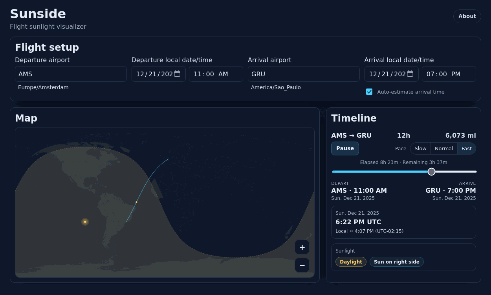

# Sunside – Flight Sunlight Visualizer

[](https://github.com/def324/sunside/actions/workflows/build.yml)
[](https://github.com/def324/sunside/actions/workflows/test.yml)
[](https://github.com/def324/sunside/actions/workflows/pages.yml)
[](https://def324.github.io/sunside/)


Sunside helps you decide which side of the plane to sit on by visualizing sunlight along a flight.

https://def324.github.io/sunside/

## Demo

<picture>
  <source srcset="docs/images/demo.webp" type="image/webp" />
  
</picture>

## Credit / inspiration

Sunside is heavily inspired by [sunflight.org](https://sunflight.org). It’s a fantastic tool and deserves the credit for popularizing this “sun side seat” visualization.

As of December 2025, sunflight.org appears to be unavailable. If/when it comes back, it’s worth using. It’s a great reference implementation.

## What it does

- Pick departure/arrival airports and local times (per-airport time zones).
- Play or scrub a timeline to see the aircraft move along the great-circle route.
- Visualize the global day/night terminator, a subtle civil twilight band, and the subsolar sun marker.
- See aircraft-local daylight state and relative sun direction (when visible).
- Remembers a few UI preferences in local storage (auto-estimate, distance units, pace).

On first load, the app defaults to `AMS → GRU` on today’s date (`11:00` departure, `19:00` arrival; local times). Auto-estimate is enabled, but the initial arrival time is a curated example; changing route/departure will apply auto-estimate.

## Run locally

Requirements: **Node.js 24.x LTS** + npm.

```bash
npm install
npm run dev
```

Run the unit tests once:

```bash
npm test -- --run
```

`npm test` starts Vitest in watch mode (blocks / keeps running).

Full end-to-end rebuild (regenerate data/assets + test + build):

```bash
npm run build:all
```

## Documentation

Start here:

- `docs/architecture.md`
- `docs/testing.md`
- `docs/data-sources.md`
- `docs/tech-stack.md`
- `docs/development-notes.md`

## Notes on accuracy

- Global overlay: day/night (sun altitude > 0) + civil twilight (sun altitude between `0°` and `-6°`) from the subsolar point.
- Sun marker: the subsolar point (sun at zenith).
- Aircraft-local sunlight (day/twilight/night + direction) is computed at the aircraft position using SunCalc.

## AI disclosure

This project is developed using AI models with human oversight. AI assistance is used for things like code generation, refactoring, and debugging; changes are reviewed and validated with tests.
